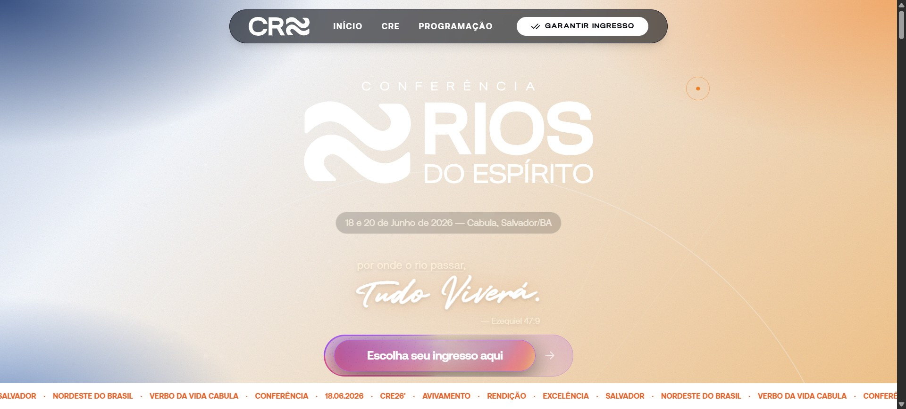

# Landing Page - Conferência Rios do Espírito 🌊

> **Uma landing page moderna, responsiva e de alta conversão para a conferência Rios do Espírito. Projetada para informar, engajar e converter visitantes em participantes.**

---



*Uma plataforma digital completa que apresenta, promove e vende a experiência Rios do Espírito*

[](https://opensource.org/licenses/MIT)


**Visite:** [Rios do Espírito](https://conferenciariosdoespirito.vercel.app/) | Adquira ingressos e participe desta jornada

---

## 🎯 O que é o Projeto?

A **landing page oficial** da conferência Rios do Espírito é um projeto web completo que funciona como:

📍 **Hub Central**: Único ponto de referência para tudo sobre a conferência  
🎫 **E-commerce**: Plataforma de vendas de ingressos integrada e segura  
📱 **Experiência Imersiva**: Design responsivo e intuitivo que funciona perfeitamente em todos os dispositivos  
📊 **Ferramenta de Marketing**: Captura leads, rastreia comportamento e otimiza conversão  
🔄 **Comunicação**: Mantém participantes informados sobre agenda, ministros e atualizações  
💡 **Profissionalismo**: Transmite credibilidade e qualidade do evento  

---

## 💡 Por que a Landing Page?

A landing page foi desenvolvida para ser a **porta digital** da conferência Rios do Espírito, resolvendo desafios críticos:

### Problema
Promover um evento sem plataforma digital moderna é:
- Difícil transmitir profissionalismo e credibilidade
- Impossível gerenciar vendas de forma centralizada e segura
- Complexo manter participantes informados
- Ineficiente rastrear interesse e otimizar conversão
- Arriscado não ter presença profissional online

### Solução: A Landing Page
- **Presença profissional**: Transmite qualidade, organização e credibilidade instantaneamente
- **Vendas centralizadas**: Sistema de ingressos integrado, seguro e fácil de usar
- **Informação estratégica**: Tudo organizado e acessível: agenda, ministros, FAQ, mapa, contato
- **Engajamento Visual**: Design imersivo com animações, fotos e testimonials que inspiram
- **Data-Driven**: Analytics integrado para rastrear interesse e otimizar futuros eventos

---

## ⚙️ Stack Tecnológica

A landing page foi construída com as **tecnologias mais modernas da web** para garantir performance, escalabilidade e experiência de usuário excepcional:

| Camada | Tecnologias |
|--------|-------------|
| **Build & Development** |  Vite – Builds 10x mais rápidos com HMR instantâneo |
| **Frontend Framework** |  React 19 – Interface reativa otimizada |
| **Linguagem** |  TypeScript – Tipagem estática e segurança |
| **Estilização** |  Tailwind CSS v4 – Design system responsivo |
| **Animações** | **Framer Motion** + **GSAP** – Transições fluidas e impactantes |
| **Ícones** |  Lucide React & React Icons – Biblioteca completa |
| **Interatividade** | **Canvas Confetti** – Efeitos visuais de engajamento |
| **Mapa** | **Leaflet + React Leaflet** – Integração de localização do evento |
| **Deploy** |  Vercel – Infraestrutura global |

### 🛠️ Decisões Técnicas

- **Vite + React**: Build system 10x mais rápido que alternativas, essencial para landing pages de alta performance
- **Lazy Loading**: Componentes críticos carregam primeiro, resto sob demanda para otimizar FCP e LCP
- **TypeScript**: Tipagem rigorosa especialmente importante em manipulação de dados de ingresso e APIs
- **Tailwind CSS**: Abordagem utilitária escalável que mantém CSS bundle mínimo na produção

---

## 🚀 Quick Start

### Pré-requisitos

- Node.js v18+
- npm, yarn ou bun
- Git

### Instalação e Desenvolvimento

```bash
# Clonar o repositório
git clone https://github.com/Carlos2505dev/rios-do-espirito-lp.git
cd rios-do-espirito

# Instalar as dependências
npm install

# Iniciar o servidor de desenvolvimento (HMR ativado)
npm run dev
```

### Build para Produção

```bash
# Criar build otimizada
npm run build

# Preview da versão de produção localmente
npm run preview

# Fazer deploy automático via Vercel
```

---

## 🎨 Funcionalidades da Landing Page

### 🎤 Seção Hero + LineUp

Primeira impressão impactante com:
- Banner de alta qualidade com imagem/vídeo do evento
- Destaque dos ministros principais
- Chamada para ação (CTA) estratégica acima da dobra
- Tagline e propósito da conferência

### 👥 Galeria Completa de Ministros

Apresenta todos os palestrantes com:
- Fotos profissionais de alta qualidade
- Biografia e descrição do ministério
- Horários de apresentação
- Links para redes sociais e contato

### 📅 Timeline de Programação

Visualização clara da agenda com:
- Timeline interativa por dia/horários
- Descrição de cada atividade
- Local e duração de cada sessão
- Destaque de atividades principais

### 🎟️ Sistema de Compra de Ingressos

E-commerce integrado com:
- Múltiplas categorias de ingresso (Camarote, Setores, Meia-entrada)
- Visualização em tempo real de disponibilidade
- Carrinho de compras e checkout seguro
- Download automático de e-ticket
- Confirmação por email com QR code

### 📍 Mapa Interativo

Localização e logística:
- Mapa em tempo real com endereço do venue
- Informações de estacionamento
- Rotas de transporte público e privado
- Pontos de interesse próximos

### 💬 Testimonials & Galeria

Prova social e engajamento:
- Depoimentos com fotos de edições anteriores
- Galeria de fotos do evento anterior
- Vídeos de momentos-chave
- Métricas de impacto

### ❓ FAQ Dinâmico

Suporte ao visitante:
- Perguntas organizadas por categoria
- Respostas diretas e informativas
- Busca integrada
- Link para contato quando necessário

### 🤝 Seção de Parceiros

Credibilidade e patrocínio:
- Logos de parceiros estratégicos
- Links diretos para sites dos parceiros
- Descrição do tipo de parceria

### 🎁 Call-to-Actions Estratégicos

Conversão otimizada:
- CTA flutuante para compra de ingressos
- Botões de ação em seções principais
- Links para redes sociais
- Convite para newsletter

### ✨ Experiências Anteriores

Conexão emocional:
- Fotos/vídeos de edições passadas
- Depoimentos em vídeo
- Estatísticas de participação
- Histórias de transformação

---

## 📁 Estrutura do Projeto

```bash
src/
├── components/                      # Componentes da Landing Page
│   ├── ui/                         # Componentes base reutilizáveis
│   │   ├── button.tsx              # Buttons para CTA
│   │   └── StaggeredMenu.tsx       # Navegação com animações
│   ├── Hero.tsx                    # Seção hero com banner principal
│   ├── LineUp.tsx                  # Destaque dos ministros principais
│   ├── Ministros.tsx               # Galeria completa de ministros
│   ├── About.tsx                   # Sobre a conferência e impacto
│   ├── Experience.tsx              # Experiências de edições anteriores
│   ├── WhatWeLived.tsx             # Momentos importantes vividos
│   ├── Programacao.tsx             # Timeline da agenda
│   ├── Testimonials.tsx            # Depoimentos e prova social
│   ├── Tickets.tsx                 # Sistema de compra de ingressos
│   ├── FAQ.tsx                     # Perguntas frequentes
│   ├── Partners.tsx                # Parceiros e patrocinadores
│   ├── MapComponent.tsx            # Mapa de localização
│   ├── CallToAction.tsx            # CTAs principais
│   ├── FloatingCTA.tsx             # CTA flutuante sticky
│   ├── CustomCursor.tsx            # Efeito visual customizado
│   ├── Navbar.tsx                  # Navegação e logo
│   ├── JejumSection.tsx            # Seção especial
│   └── Footer.tsx                  # Rodapé com links
├── App.tsx                         # Componente raiz com Suspense
├── App.css                         # Estilos globais
├── main.tsx                        # Entry point
├── index.css                       # Design tokens
└── config/                         # Configurações do projeto
    ├── vite.config.ts
    ├── tsconfig.json
    └── vercel.json
```

### Estratégia de Carregamento

- **Lazy Loading com Suspense**: Componentes acima da dobra (Navbar, Hero, LineUp) carregam primeiro
- **Progressive Enhancement**: Fallbacks gracioso para componentes secundários
- **Code Splitting**: Bundle otimizado para produção

---

## ⚡ Performance & Otimizações

Landing page otimizada para máxima velocidade e conversão:

- **Tree Shaking**: Código morto elimina automaticamente
- **Code Splitting**: Bundle dividido em chunks menores
- **Image Optimization**: Compressão WebP com fallback
- **Lazy Loading**: Componentes carregam conforme necessário
- **CSS Purging**: Apenas classes usadas incluídas
- **Minificação**: Assets totalmente minificados em produção

## 🎬 Experiência do Usuário

### Design & Interatividade
- Entrada fluida de elementos ao scroll (fade-in, slide-up)
- Transições suaves entre seções
- Efeitos parallax nos backgrounds
- Animações de celebração ao converter (confetti)
- Cursor customizado para reforçar brand

### Responsividade
- Mobile-first com breakpoints estratégicos
- Toque otimizado para dispositivos móveis
- Imagens que se reescalam inteligentemente
- Navegação adaptável a diferentes telas

### Acessibilidade
- Contraste WCAG AA
- Navegação por teclado completa
- Atributos ARIA implementados
- Textos alternativos em imagens

---

### Comandos Disponíveis

```bash
# Iniciar dev server com HMR (Hot Module Replacement)
npm run dev

# Validar código com ESLint
npm run lint

# Build otimizada para produção
npm run build

# Visualizar como ficará em produção
npm run preview
```
---

## 📄 Licença

Distribuído sob a licença MIT. Veja [LICENSE](LICENSE) para mais informações.

---

## ✍️ Desenvolvido Por

Desenvolvido com **dedicação, oração e muito café** por:

**Carlos Neto**  
*Desenvolvedor Web & Mobile apaixonado por criar experiências digitais que impactam*

---

> "Uma plataforma digital que transforma visitantes em participantes da Conferência Rios do Espírito." 🌊✨

