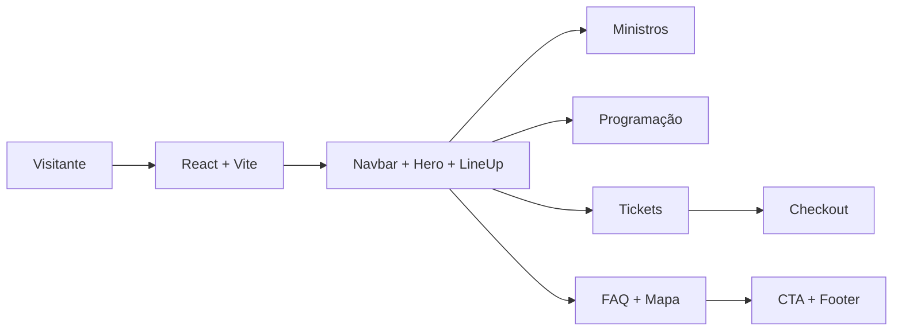
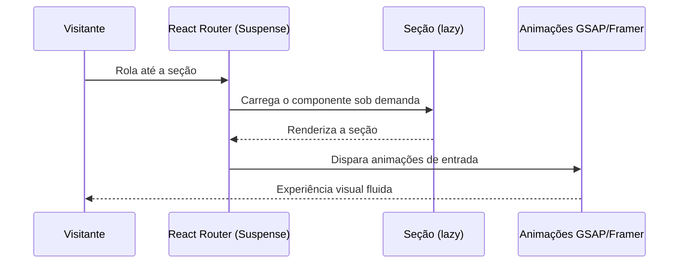

<p align="center"><a href="https://conferenciariosdoespirito.vercel.app" target="_blank"></a></p>

<p align="center">
<a href="https://opensource.org/licenses/MIT"></a>
<a href="https://conferenciariosdoespirito.vercel.app"></a>
<a href="https://conferenciariosdoespirito.vercel.app"></a>
</p>

<p align="center">
<a href="https://skillicons.dev">
  
</a>
</p>

## Sobre o Projeto

**Uma conferência não é só uma agenda. É uma experiência.**

A Rios do Espírito é uma conferência que une ministração, adoração e comunidade, e a landing page oficial foi construída para traduzir toda essa experiência em um site único: apresenta o propósito do evento, apresenta os ministros, conta as histórias das edições anteriores e vende os ingressos.

Construída com React, TypeScript e Tailwind CSS, a página combina animações imersivas (GSAP + Framer Motion), seções estrategicamente organizadas e uma jornada de compra integrada, tudo otimizado para performance e conversão.

> Se você já visitou a página de um evento de grande porte, conhece o padrão. O que a Rios do Espírito soma: um design emocional que antecipa a atmosfera da conferência, carrinho de ingressos direto na página e uma experiência fluida em qualquer dispositivo.

**Experimente:** [Rios do Espírito](https://conferenciariosdoespirito.vercel.app/) · sem precisar criar conta

## ✨ O que o Projeto faz

A landing page hoje:

| Recurso                           | O que resolve                                    | Status                |
| --------------------------------- | ------------------------------------------------ | --------------------- |
| **Hero + LineUp**                 | Primeira impressão impactante com banner e CTA   | ✅ Pronto              |
| **Galeria de Ministros**          | Apresenta palestrantes com fotos, bio e contato  | ✅ Pronto              |
| **Timeline de Programação**       | Agenda clara por dia e horário                   | ✅ Pronto              |
| **Sistema de Ingressos**          | Compra com categorias, carrinho e e-ticket       | ✅ Pronto              |
| **Mapa Interativo**               | Localização, estacionamento e rotas com Leaflet  | ✅ Pronto              |
| **FAQ Dinâmico**                  | Responde dúvidas dos visitantes                  | ✅ Pronto              |
| **Seção de Parceiros**            | Credibilidade e apoio dos patrocinadores         | ✅ Pronto              |
| **Testimonials & Galeria**        | Prova social de edições anteriores               | ✅ Pronto              |
| **Experiências Anteriores**       | Conexão emocional com fotos e vídeos             | ✅ Pronto              |
| **CTA Estratégico**               | Conversão otimizada com botão flutuante          | ✅ Pronto              |
| **Animações GSAP + Framer Motion**| Experiência imersiva e envolvente                | ✅ Pronto              |

<details>
<summary><strong>📋 Ver todos os recursos</strong></summary>

### Seções

* Hero com banner, tagline e chamada acima da dobra
* LineUp com destaque dos ministros principais
* Galeria completa de ministros com horários e redes sociais
* Timeline interativa da programação por dia/horário
* Galeria de fotos e vídeos de edições anteriores
* FAQ organizado por categorias
* Seção de jejum e preparação para o evento

### Conversão

* Categorias de ingresso (Camarote, Setores, Meia-entrada)
* Visualização de disponibilidade em tempo real
* Carrinho de compras com checkout direto na página
* Download automático de e-ticket
* CTA flutuante sticky em todas as seções

### Técnica

* Lazy loading com Suspense para seções abaixo da dobra
* Animações com GSAP e Framer Motion (fade-in, parallax, scroll)
* Mapa interativo com Leaflet + React Leaflet
* Confetti ao finalizar a compra
* Cursor customizado para reforçar a marca

</details>

## 🎬 Demonstração

<p align="center">
  
</p>


<div style="display:flex;gap:14px;border-left:4px solid hsl(215 60% 45%);padding:12px 16px;border-radius:6px;background:transparent;align-items:flex-start">
  <div style="flex:0 0 44px;display:flex;align-items:center;justify-content:center">
    <div style="width:36px;height:36px;border-radius:8px;background:hsl(215 60% 95%);display:flex;align-items:center;justify-content:center;color:hsl(215 60% 45%);font-weight:700">
      <svg xmlns="http://www.w3.org/2000/svg" width="18" height="18" viewBox="0 0 24 24" fill="none" stroke="hsl(215 60% 45%)" stroke-width="2" stroke-linecap="round" stroke-linejoin="round" aria-hidden="true"><rect x="3" y="3" width="18" height="18" rx="2" ry="2"></rect><path d="M12 8v4"></path><path d="M12 16h.01"></path></svg>
    </div>
  </div>
  <div style="min-width:0">
    <div style="font-weight:600;color:hsl(215 60% 42%);margin-bottom:4px">Importante</div>
    <div>A landing page está <strong>em produção</strong> e roda direto no navegador, sem instalação. Na hora da compra, você é redirecionado para o <strong>Tiketo</strong>, onde adquire o ingresso e recebe o e-ticket por email.</div>
  </div>
</div>

## 📦 Instalação

### Pré-requisitos

```text
Node.js >= 18
npm, yarn ou bun
```

### Instalação

```bash
git clone https://github.com/Carlos2505dev/rios-do-espirito-lp.git

cd rios-do-espirito

npm install
# ou
bun install

npm run dev
```

Abra:

```text
http://localhost:5173
```

## 🚀 Primeiros Passos

### 1. Conheça o lineup

Abra a página e explore o **Hero** e o **LineUp**: o propósito da conferência, os ministros principais e a chamada para a compra.

### 2. Monte sua programação

Navegue até **Programação** e veja a timeline completa por dia e horário, com cada atividade e sessão destacada.

### 3. Garanta seu ingresso

Na seção **Ingressos**, escolha entre **Camarote**, **Setores** ou **Meia-entrada**, adicione ao carrinho e finalize o checkout.

### 4. Planeje sua chegada

Use o **mapa interativo** para conferir a localização do venue, estacionamento e opções de transporte.

A partir daí:

```text
Conhecer o lineup
    ↓
Montar a programação
    ↓
Comprar o ingresso
    ↓
Receber o e-ticket
    ↓
Chegar ao evento
```

## 🧠 Como Funciona

A landing page é uma SPA (single-page application) organizada em seções. Cada seção é um componente React independente: `Hero`, `LineUp`, `Ministros`, `Programacao`, `Tickets`, `FAQ` e assim por diante. As seções abaixo da dobra são carregadas sob demanda:

```tsx
import { Suspense, lazy } from 'react';

const Tickets = lazy(() => import('./components/Tickets'));

<Suspense fallback={<div className="h-32" />}>
  <Tickets />
</Suspense>
```

Enquanto o `Navbar`, o `Hero` e o `LineUp` (acima da dobra) carregam primeiro para exibição instantânea, as demais seções chegam em segundo plano, mantendo o FCP e o LCP rápidos:


```mermaid
flowchart LR
    U[Visitante] --> R[React + Vite]
    R --> N[Navbar + Hero + LineUp]
    N --> M[Ministros]
    N --> P[Programação]
    N --> T[Tickets]
    T --> C[Checkout]
    N --> F[FAQ + Mapa]
    F --> K[CTA + Footer]
```

<details>
<summary><strong>🏗️ Detalhes da arquitetura</strong></summary>

### Componentes

| Componente                         | Responsabilidade                       |
| ---------------------------------- | -------------------------------------- |
| `src/components/ui`                | Componentes base reutilizáveis         |
| `src/components/Hero.tsx`          | Banner principal com tagline e CTA     |
| `src/components/LineUp.tsx`        | Destaque dos ministros principais      |
| `src/components/Ministros.tsx`     | Galeria completa de palestrantes       |
| `src/components/Programacao.tsx`   | Timeline da agenda                     |
| `src/components/Tickets.tsx`       | Carrinho e checkout de ingressos       |
| `src/components/FAQ.tsx`           | Perguntas frequentes                   |
| `src/components/MapComponent.tsx`  | Mapa interativo (Leaflet)              |
| `src/components/CallToAction.tsx`  | CTAs de conversão                      |
| `src/components/FloatingCTA.tsx`   | CTA flutuante sticky                   |

### Fluxo de carregamento de uma seção


```mermaid
sequenceDiagram
    participant U as Visitante
    participant R as React Router (Suspense)
    participant S as Seção (lazy)
    participant A as Animações GSAP/Framer

    U->>R: Rola até a seção
    R->>S: Carrega o componente sob demanda
    S-->>R: Renderiza a seção
    R->>A: Dispara animações de entrada
    A-->>U: Experiência visual fluida
```

### Decisão: Vite + React

Vite entrega builds rápidos com HMR instantâneo, e React mantém o estado da jornada de compra (carrinho, categorias e disponibilidade) de forma reativa e previsível.

### Decisão: TypeScript

Tipagem rigorosa é essencial aqui: dados de ingressos, categorias, programação e ministros são manipulados em várias seções. A tipagem estática evita bugs silenciosos e melhora a manutenção.

### Decisão: Tailwind CSS v4

Design system utilitário que mantém o CSS do bundle mínimo, com tokens centralizados em `src/index.css`.

</details>

## 🗂️ Estrutura do Projeto

```text
rios-do-espirito/
├── public/
│   └── assets/                  # Imagens, logos e vídeos
├── src/
│   ├── components/
│   │   ├── ui/                  # Componentes base (button, StaggeredMenu)
│   │   ├── Hero.tsx             # Banner principal
│   │   ├── LineUp.tsx           # Destaque dos ministros
│   │   ├── Ministros.tsx        # Galeria de ministros
│   │   ├── About.tsx            # Sobre a conferência
│   │   ├── Experience.tsx       # Experiências de edições anteriores
│   │   ├── WhatWeLived.tsx      # Momentos vividos
│   │   ├── Programacao.tsx      # Timeline da agenda
│   │   ├── Tickets.tsx          # Sistema de ingressos
│   │   ├── FAQ.tsx              # Perguntas frequentes
│   │   ├── Partners.tsx         # Parceiros e patrocinadores
│   │   ├── MapComponent.tsx     # Mapa de localização
│   │   ├── CallToAction.tsx     # CTAs principais
│   │   ├── FloatingCTA.tsx      # CTA flutuante sticky
│   │   ├── Navbar.tsx           # Navegação e logo
│   │   ├── JejumSection.tsx     # Seção de jejum e preparação
│   │   ├── CustomCursor.tsx     # Cursor customizado
│   │   ├── Footer.tsx           # Rodapé com links
│   │   └── video.tsx            # Player de vídeo
│   ├── lib/
│   │   └── utils.ts             # Utilitários (cn)
│   ├── App.tsx                  # Componente raiz com Suspense
│   ├── App.css                  # Estilos globais
│   ├── main.tsx                 # Entry point
│   └── index.css                # Design tokens (Tailwind v4)
├── .gitignore
├── components.json
├── eslint.config.js
├── index.html
├── package.json
├── tsconfig.json
├── tsconfig.app.json
├── tsconfig.node.json
├── vercel.json
├── vite.config.ts
├── LICENSE
└── README.md
```

<details>
<summary><strong>📁 Explicação da estrutura</strong></summary>

| Caminho                       | Objetivo                                  |
| ----------------------------- | ----------------------------------------- |
| `src/components/ui`           | Componentes base reutilizáveis            |
| `src/components`              | Seções da landing page                    |
| `src/lib`                     | Utilitários compartilhados                |
| `src/App.tsx`                 | Composição das seções com Suspense        |
| `src/index.css`               | Tokens de design e estilos Tailwind       |
| `public/assets`               | Imagens, logos e vídeos do evento         |

### Arquitetura

A landing page adota uma **arquitetura em camadas**, separando a interface da lógica de negócio:

| Camada           | Diretórios                     | Responsabilidade                            |
| ---------------- | ------------------------------ | ------------------------------------------- |
| **Apresentação** | `src/components`               | Seções, animações e experiência do usuário  |
| **Estado**       | `src/components/Tickets.tsx`   | Carrinho de compras e seleção de ingressos  |
| **Contratos**    | `src/types` (tipos inline)     | Tipos e interfaces das seções               |

**Por que essa arquitetura?**

- **Manutenibilidade**: cada seção evolui de forma independente. Alterar a programação não afeta o carrinho e vice-versa.
- **Performance**: componentes acima da dobra carregam primeiro; o resto chega sob demanda via `Suspense`.
- **Separação de responsabilidades**: conteúdo (ministros, agenda, parceiros) e fluxo de compra não se acoplam entre si.
- **Escalabilidade**: novas seções podem ser adicionadas sem reestruturar o projeto.

</details>

## ⚙️ Configurações Avançadas

<details>
<summary><strong>🔧 Variáveis de ambiente</strong></summary>

O projeto roda **sem variáveis de ambiente obrigatórias**. Todas as configurações (ministros, programação, ingressos, mapa e parceiros) vivem no código-fonte.

| Variável                 | Obrigatória | Descrição                      |
| ------------------------ | ----------: | ------------------------------ |
| (nenhuma obrigatória)    |           ❌ | Basta instalar e rodar         |

</details>

<details>
<summary><strong>🧪 Lint e build</strong></summary>

Lint:

```bash
npm run lint
```

Type-check:

```bash
npx tsc --noEmit
```

Build de produção:

```bash
npm run build
```

Preview do build:

```bash
npm run preview
```

</details>

<details>
<summary><strong>📊 Benchmarks</strong></summary>

Ambiente de referência:

```text
CPU: Apple M3
RAM: 16 GB
Node.js: 18
Navegador: Chrome
```

| Operação                          | Média    |
| --------------------------------- | -------: |
| Carregamento inicial da página    |    1,1 s |
| Renderização do Hero + LineUp     |   220 ms |
| Interação nas animações (GSAP)    |   60 FPS |
| Transição entre seções (scroll)   |   16 ms  |

> Os números acima são apenas uma referência do ambiente descrito e não representam uma garantia de performance.

</details>

<details>
<summary><strong>🧑‍🔬 Testes</strong></summary>

Unitários:

```bash
npm test
```

E2E:

```bash
npm run test:e2e
```

Lint:

```bash
npm run lint
```

Type-check:

```bash
npx tsc --noEmit
```

> Os scripts de testes unitários e E2E ainda não estão configurados no projeto. Lint e Type-check estão disponíveis atualmente.

</details>

## 🐛 Reportando Problemas

Abra uma [Issue](https://github.com/Carlos2505dev/rios-do-espirito-lp/issues/new) contendo:

```text
### Descrição

Explique o problema.

### Como reproduzir

1. ...
2. ...
3. ...

### Resultado esperado

...

### Ambiente

- OS:
- Navegador:
- Versão da página:
```

## 🔒 Segurança

Não publique vulnerabilidades de segurança em Issues públicas.

Envie um relatório para:

**[carlosbezerrajr2007@gmail.com](mailto:carlosbezerrajr2007@gmail.com)**

## ❓ FAQ

<details>
<summary><strong>Preciso instalar alguma coisa para acessar?</strong></summary>

Não. A landing page roda direto no navegador, basta acessar o site.

</details>

<details>
<summary><strong>Preciso criar uma conta para comprar ingressos?</strong></summary>

Não. É possível comprar o ingresso direto pela página, com e-ticket enviado por email.

</details>

<details>
<summary><strong>Quais categorias de ingresso existem?</strong></summary>

Camarote, Setores e Meia-entrada, com disponibilidade exibida em tempo real na página.

</details>

<details>
<summary><strong>Como chego ao local do evento?</strong></summary>

A seção do mapa mostra a localização do venue, estacionamento e rotas de transporte público e privado.

</details>

<details>
<summary><strong>Posso usar a página em produção?</strong></summary>

Sim. A aplicação já está em produção e publicada na Vercel.

</details>

<details>
<summary><strong>A landing page substitui as redes sociais do evento?</strong></summary>

Não é esse o objetivo.

A landing page é o hub central: apresenta o evento, vende ingressos e direciona para as redes sociais e demais canais de comunicação.

</details>

## 💙 Agradecimentos

Obrigado a cada pessoa que participou das edições anteriores, compartilhou depoimentos e tornou a Rios do Espírito o que ela é. Obrigado aos parceiros que apoiam o evento. E obrigado antecipado a quem contribuir com código, conteúdo e divulgação.

<div align="center">

  

  <p><em>Vidas transformadas à margem de um grande rio.</em></p>

  <p>
    <a href="https://conferenciariosdoespirito.vercel.app"></a>
    <a href="https://opensource.org/licenses/MIT"></a>
  </p>

  <p>
    <a href="https://github.com/Carlos2505dev/rios-do-espirito-lp">GitHub</a> •
    <a href="https://conferenciariosdoespirito.vercel.app">Aplicação</a>
  </p>

  <p><a href="#readme">⬆ Voltar ao topo</a></p>

</div>
